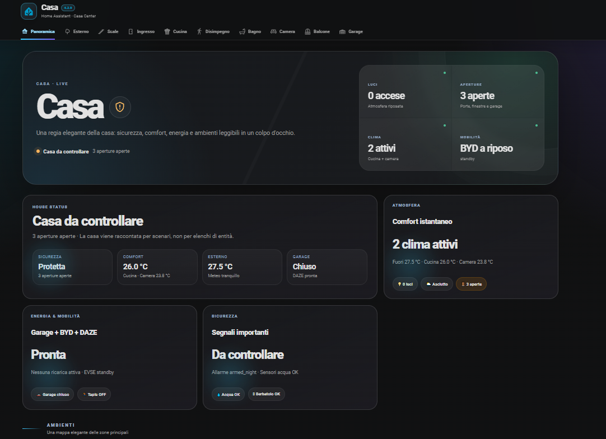
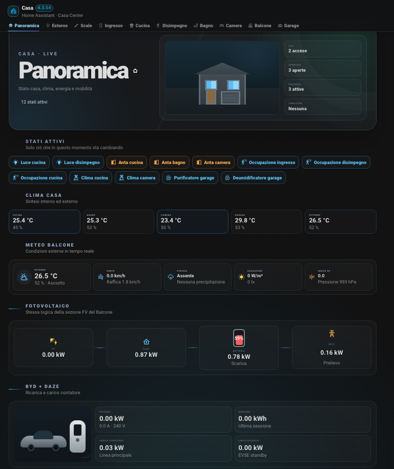
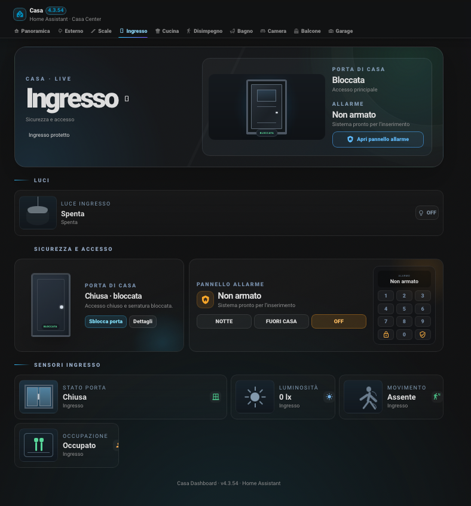
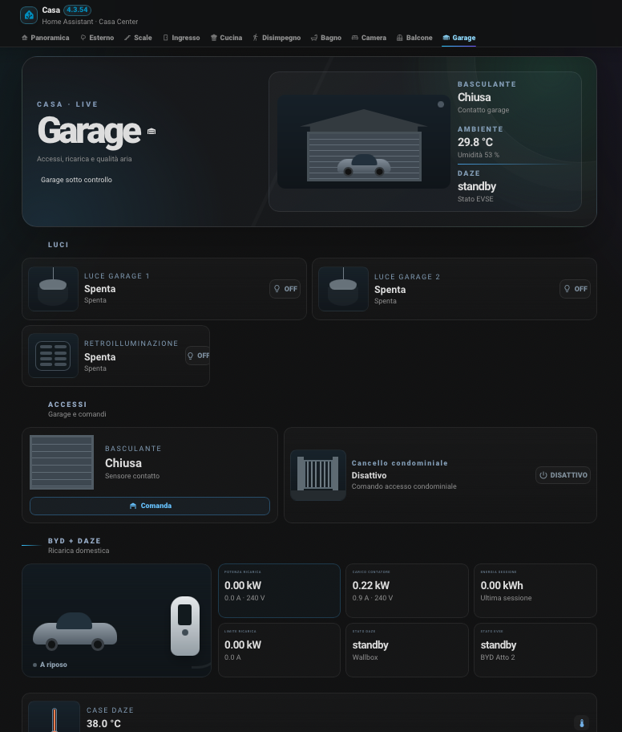

# 🏠 Casa Dashboard Community

[🇬🇧 English](README.md) | 🇮🇹 **Italiano**

Casa Dashboard Community è una dashboard app-like completa per **Home Assistant**, pensata per adattarsi ad abitazioni diverse senza dipendere dalle classiche card Lovelace.

La **v3.5.1** introduce il configuratore Casa V2 a pagine, una personalizzazione visuale molto più completa, il caricamento diretto delle foto di stanze e oggetti e il nuovo Visual Energia Avanzato, mantenendo disponibile Casa V1 Classic.

**Realizzato da Fabio Vittori** · [☕ Offrimi un caffè](https://ko-fi.com/fabvittori)

## ✨ Casa V1 + Casa V2

### Casa V1 — Classic

L'esperienza Community originale rimane disponibile.

### Casa V2 — Dynamic

La generazione configurabile di Casa Dashboard. Gli ambienti vengono costruiti intorno alla vostra casa, non intorno alla struttura dell'abitazione originale.

Altri esempi:

## ☀️ Visual Energia Avanzato

Casa V2 può mostrare la sezione Fotovoltaico in modalità **Compatta** oppure **Avanzata**.

La modalità Avanzata mostra produzione live, eventuali PV1/PV2, SOC e flusso batteria, oltre ai nodi Casa / Inverter / Batteria / Rete.

Le convenzioni del segno di Rete e Batteria sono configurabili, così il visual può adattarsi a integrazioni inverter differenti. I sensori mancanti vengono nascosti automaticamente senza lasciare spazi vuoti.

## 🧭 Configuratore a pagine

Il configuratore Casa V2 è suddiviso in pagine dedicate:

- Panoramica
- Stanze
- Dispositivi
- Energia & Mobilità
- Meteo & Sicurezza
- Avanzate

La configurazione normale rimane semplice, mentre l'elenco completo delle **173 associazioni Community opzionali** è disponibile nella pagina Avanzate.

## 🎨 Personalizzazione visuale completa

Casa V2 permette di personalizzare:

- macro-label della Panoramica;
- nome Auto e Wallbox;
- nomi visualizzati delle entità globali;
- nomi, tipi e icone delle stanze;
- foto delle stanze;
- foto dei singoli oggetti/entità.

Le foto possono essere caricate direttamente dal configuratore. Casa Dashboard le ridimensiona e comprime automaticamente e, normalmente, le salva in `/config/www/casa_dashboard_community/uploads/`, utilizzando il riferimento `/local/casa_dashboard_community/uploads/`.

Se non viene impostata una foto personalizzata, rimangono attivi il visual grafico Casa V2 e il riconoscimento intelligente del dispositivo.

## 🏠 Stanze dinamiche

Con Casa V2 è possibile:

- creare liberamente le stanze;
- rinominarle e riordinarle;
- scegliere tipo e icona;
- creare più stanze dello stesso tipo;
- rimuovere quelle inutilizzate;
- associare più entità Home Assistant alla stessa stanza.

## ⚙️ Configuratore visuale

La configurazione avviene direttamente dalla dashboard.

Le entità possono essere cercate tramite:

- friendly name Home Assistant;
- `entity_id`;
- nome visualizzato personalizzato.

Le 173 associazioni Community sono **opzionali**. È sufficiente configurare soltanto le funzioni e i dispositivi realmente presenti nel proprio Home Assistant.

Anche le associazioni globali possono avere un nome visualizzato personalizzato per la Panoramica. Se lasciato vuoto, Casa Dashboard usa il friendly name di Home Assistant e poi il nome Community.

## 🧠 Riconoscimento intelligente

Casa V2 può scegliere icona e visual usando:

1. nome visualizzato;
2. friendly name Home Assistant;
3. funzione riconosciuta;
4. icona Home Assistant;
5. `device_class`;
6. dominio dell'entità.

Questo permette anche a una presa smart generica di essere rappresentata come il dispositivo che controlla quando il nome in Home Assistant fornisce abbastanza informazioni.

## 📊 Panoramica V2

La Panoramica mette in evidenza ciò che serve davvero:

- stati attivi;
- temperature;
- condizioni esterne e meteo;
- fotovoltaico e batteria;
- dati rete;
- Wallbox ed EV.

Le sezioni non configurate restano nascoste.

## 🌍 Lingue

Supporto nativo:

- 🇮🇹 Italiano
- 🇬🇧 English

Il selettore è disponibile direttamente nella dashboard e la lingua scelta viene memorizzata localmente. I nomi personalizzati delle stanze e delle entità Home Assistant vengono mantenuti.

## 📱 Responsive

Casa V1 e Casa V2 sono progettate per desktop, tablet e smartphone.

## 📦 Installazione HACS

1. Apri **HACS**.
2. Aggiungi `https://github.com/fabiovit/casa-dashboard` come repository personalizzato di tipo **Integrazione**, oppure usa il pulsante **Add to HACS** qui sopra.
3. Installa **Casa Dashboard Community**.
4. Riavvia Home Assistant.
5. Vai in **Impostazioni → Dispositivi e servizi → Aggiungi integrazione**.
6. Cerca **Casa Dashboard Community**.
7. Apri il nuovo pannello laterale e premi **Configura**.

> Dopo l'aggiornamento alla v3.5.1 effettua un **riavvio completo di Home Assistant**, perché sono cambiati il backend dell'integrazione e lo schema WebSocket del configuratore.

## 📦 Installazione manuale

Copia `custom_components/casa_dashboard_community` in `/config/custom_components/`, riavvia Home Assistant e aggiungi l'integrazione da **Impostazioni → Dispositivi e servizi**.

## ℹ️ Note

Casa Dashboard Community è un template avanzato. Dispositivi, sensori, automazioni, fotovoltaico, EV e Wallbox sono opzionali. Le funzioni non configurate vengono nascoste automaticamente.

## 🙏 Credits

Un ringraziamento speciale a **Mario Pagano** per i feedback e i suggerimenti che hanno contribuito a migliorare il configuratore, la personalizzazione della Panoramica e la flessibilità grafica di Casa Dashboard Community.

## ☕ Supporto

Se il progetto ti piace: **[Offrimi un caffè su Ko-fi](https://ko-fi.com/fabvittori)**.
