# 🏠 Casa Dashboard Community

[🇬🇧 English](README.md) | 🇮🇹 **Italiano**

Casa Dashboard Community è una dashboard app-like completa per **Home Assistant**, pensata per adattarsi ad abitazioni diverse senza dipendere dalle classiche card Lovelace.

La **v4.1.0** è una release di consolidamento: il progetto è stato ripulito, il versioning è ora coerente tra backend e frontend e tutte le funzioni mature introdotte nella serie 2.x restano disponibili in un pacchetto più ordinato.

**Realizzato da Fabio Vittori** · [☕ Offrimi un caffè](https://ko-fi.com/fabvittori)

## 🖼️ Casa Dashboard Community 4.0

La 4.0 porta una nuova esperienza visiva coerente in **tema scuro e chiaro**, mantenendo la stessa struttura dinamica in ogni stanza.

### Panoramica

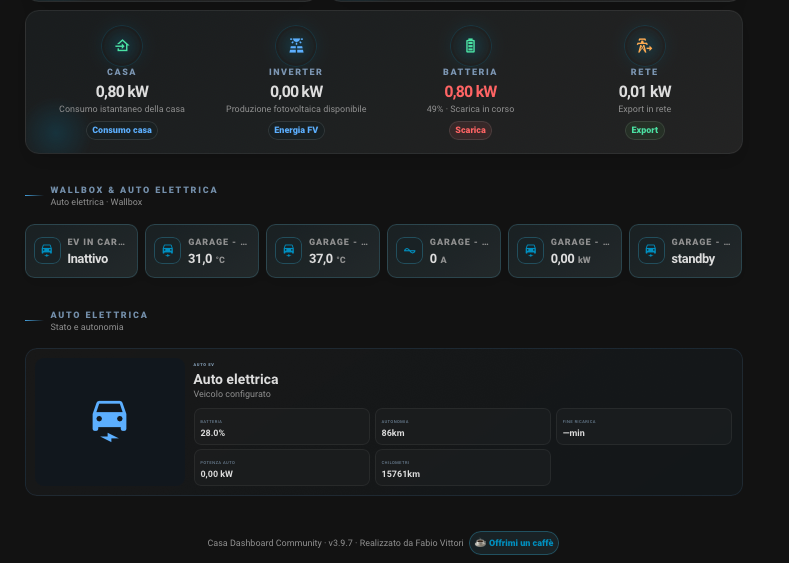

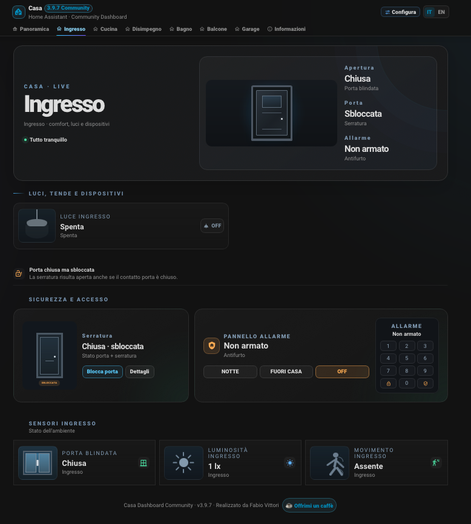

### Ingresso

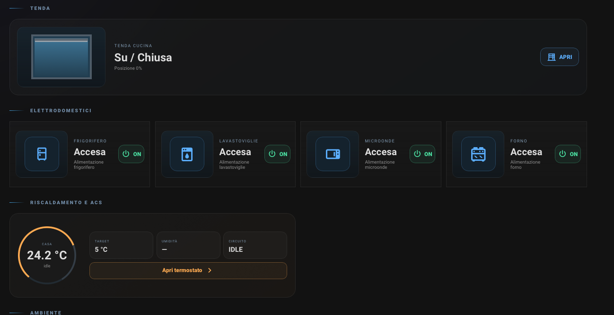

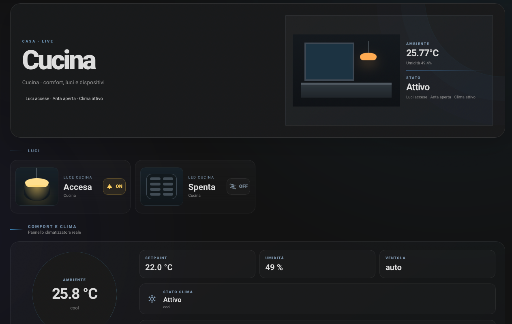

### Cucina

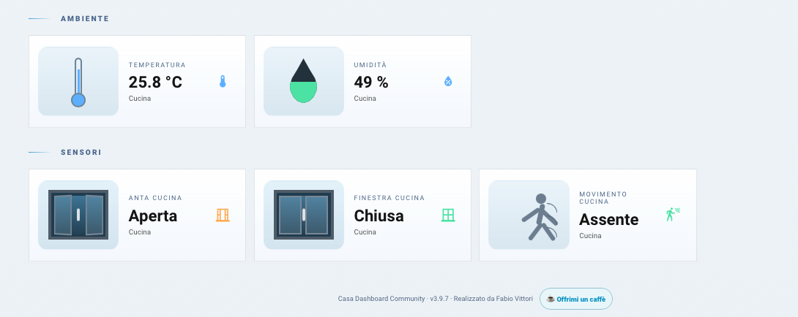

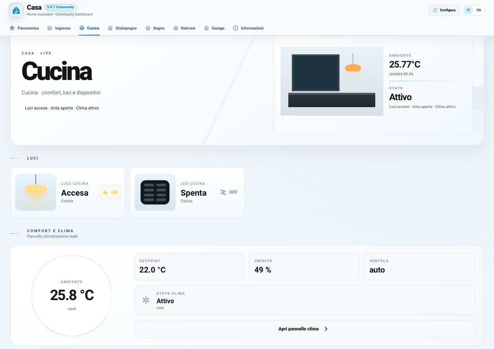

### Balcone

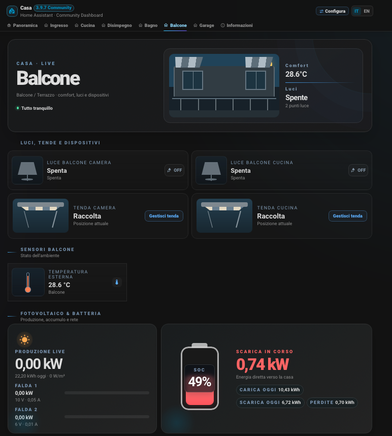

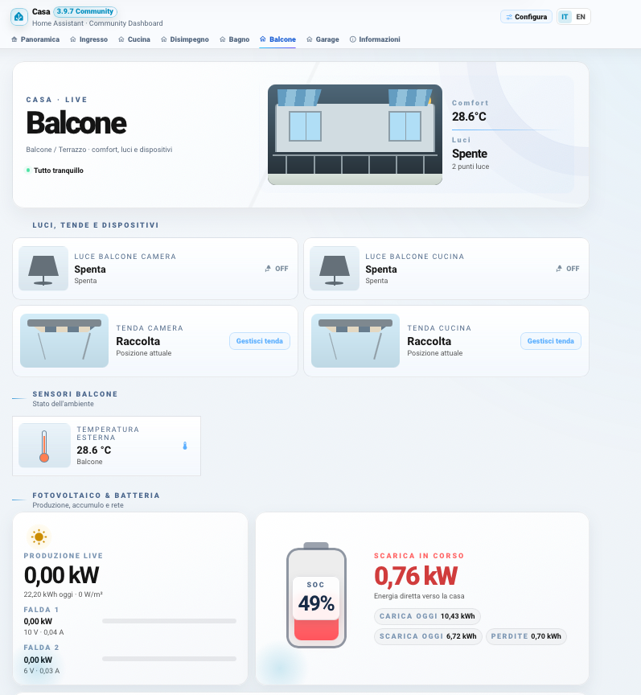

### Garage, EV e Wallbox

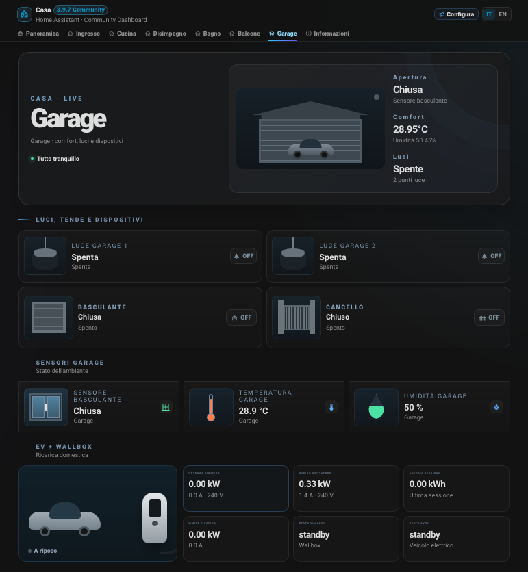

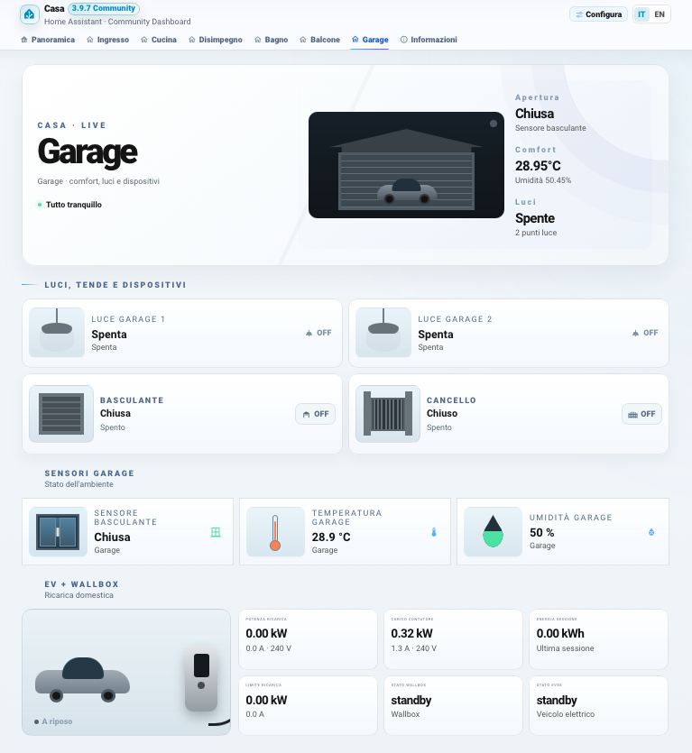

### Configuratore

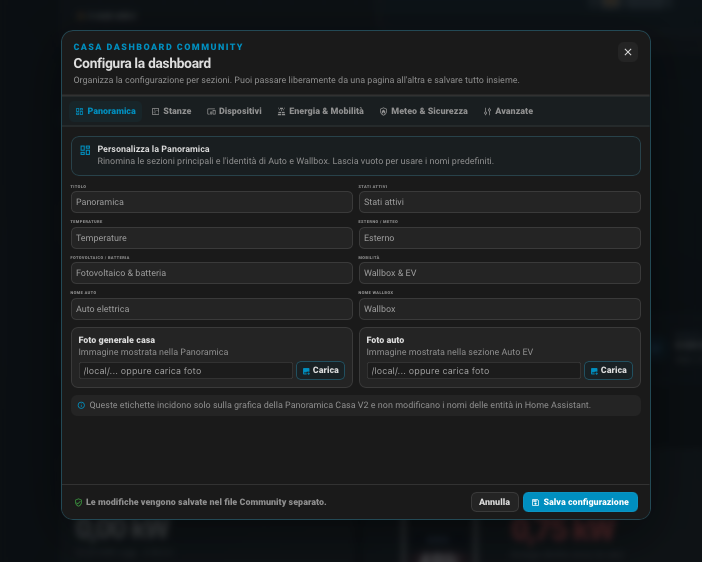

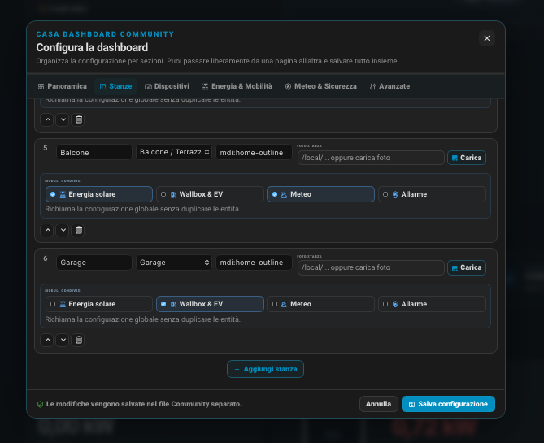

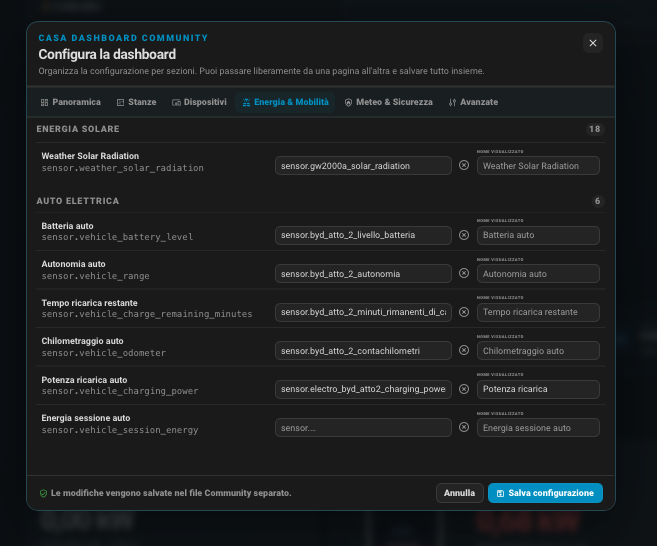

## 🛡️ Sicurezza e accesso

Le stanze dinamiche Casa V2 riconoscono ora le entità `lock.*` e `alarm_control_panel.*`.

Quando configurate in una stanza, Casa Dashboard aggiunge automaticamente una sezione **Sicurezza e accesso** con stato serratura, comandi Blocca / Sblocca, stato antifurto e comandi rapidi Notte / Fuori casa / Off.

## ☀️ Visual Energia Avanzato

Casa V2 permette ora di scegliere la sezione Fotovoltaico in modalità **Compatta** oppure **Avanzata**.

La modalità Avanzata mostra produzione live, eventuali PV1/PV2, SOC e flusso batteria, oltre ai nodi Casa / Inverter / Batteria / Rete.

Le convenzioni del segno di Rete e Batteria sono configurabili, così il visual può adattarsi a integrazioni inverter differenti.

## 🧭 Configuratore a pagine

Il configuratore Casa V2 è ora suddiviso in pagine dedicate:

- Panoramica
- Stanze
- Dispositivi
- Energia & Mobilità
- Meteo & Sicurezza
- Avanzate

La configurazione normale rimane semplice, mentre l'elenco completo delle 173 associazioni viene spostato nella pagina avanzata.

## 🎨 Personalizzazione visuale completa

Casa V2 permette ora di personalizzare le macro-label della Panoramica, il nome dell'auto e il nome della Wallbox.

Ogni stanza può inoltre utilizzare una foto personalizzata. È possibile indicare un percorso Home Assistant `/local/...` (ad esempio `/local/casa/cucina.jpg`) oppure un URL immagine. Se il campo resta vuoto, viene mantenuto il normale visual Casa V2.

## 🏠 Stanze dinamiche

Con Casa V2 è possibile:

- creare liberamente le stanze;
- rinominarle e riordinarle;
- scegliere tipo e icona;
- creare più stanze dello stesso tipo;
- rimuovere quelle inutilizzate;
- associare più entità Home Assistant alla stessa stanza.

## ⚙️ Configuratore visuale

La configurazione avviene direttamente dalla dashboard.

Le entità possono essere cercate tramite:

- friendly name Home Assistant;
- `entity_id`;
- nome visualizzato personalizzato.

Il configuratore mantiene le **173 associazioni Community** usate dalle funzioni globali e specialistiche.

Anche le associazioni globali possono avere un **nome visualizzato personalizzato** per la Panoramica. Se lasciato vuoto, Casa Dashboard usa il friendly name di Home Assistant e poi il nome Community.

Le installazioni grandi sono gestite con scroll separati e bilanciati per Stanze e associazioni entità.

## 🧠 Riconoscimento intelligente

Casa V2 può scegliere icona e visual usando:

1. nome visualizzato;
2. friendly name Home Assistant;
3. funzione riconosciuta;
4. icona Home Assistant;
5. `device_class`;
6. dominio dell'entità.

Questo permette anche a una presa smart generica di essere rappresentata come il dispositivo che controlla quando il nome in Home Assistant fornisce abbastanza informazioni.

## 📊 Panoramica V2

La Panoramica mette in evidenza ciò che serve davvero:

- stati attivi;
- temperature;
- condizioni esterne e meteo;
- fotovoltaico e batteria;
- dati rete;
- Wallbox ed EV.

Le sezioni non configurate restano nascoste.

## 🌍 Lingue

Supporto nativo:

- 🇮🇹 Italiano
- 🇬🇧 English

Il selettore è disponibile direttamente nella dashboard e la lingua scelta viene memorizzata localmente.

I nomi personalizzati delle stanze e delle entità Home Assistant vengono mantenuti.

Anche le singole entità V2 possono avere una foto personalizzata. Usa **Carica** nel configuratore della stanza per luci, prese, elettrodomestici, sensori e altri oggetti. Le foto vengono ridimensionate e salvate sotto `/local/casa_dashboard_community/uploads/`; senza foto resta il visual automatico V2.

## 📱 Responsive

Casa V1 e Casa V2 sono progettate per desktop e smartphone.

## 📦 Installazione HACS

1. Apri **HACS**.
2. Aggiungi `https://github.com/fabiovit/casa-dashboard` come repository personalizzato di tipo **Integrazione**, oppure usa il pulsante **Add to HACS** qui sopra.
3. Installa **Casa Dashboard Community**.
4. Riavvia Home Assistant.
5. Vai in **Impostazioni → Dispositivi e servizi → Aggiungi integrazione**.
6. Cerca **Casa Dashboard Community**.
7. Apri il nuovo pannello laterale e premi **Configura**.

## 📦 Installazione manuale

Copia `custom_components/casa_dashboard_community` in `/config/custom_components/`, riavvia Home Assistant e aggiungi l'integrazione da **Impostazioni → Dispositivi e servizi**.

## ℹ️ Note

Casa Dashboard Community è un template avanzato. Dispositivi, sensori, automazioni, fotovoltaico, EV e Wallbox sono opzionali.

Le funzioni non configurate vengono nascoste automaticamente.

## ☕ Supporto

Se il progetto ti piace: **[Offrimi un caffè su Ko-fi](https://ko-fi.com/fabvittori)**.
