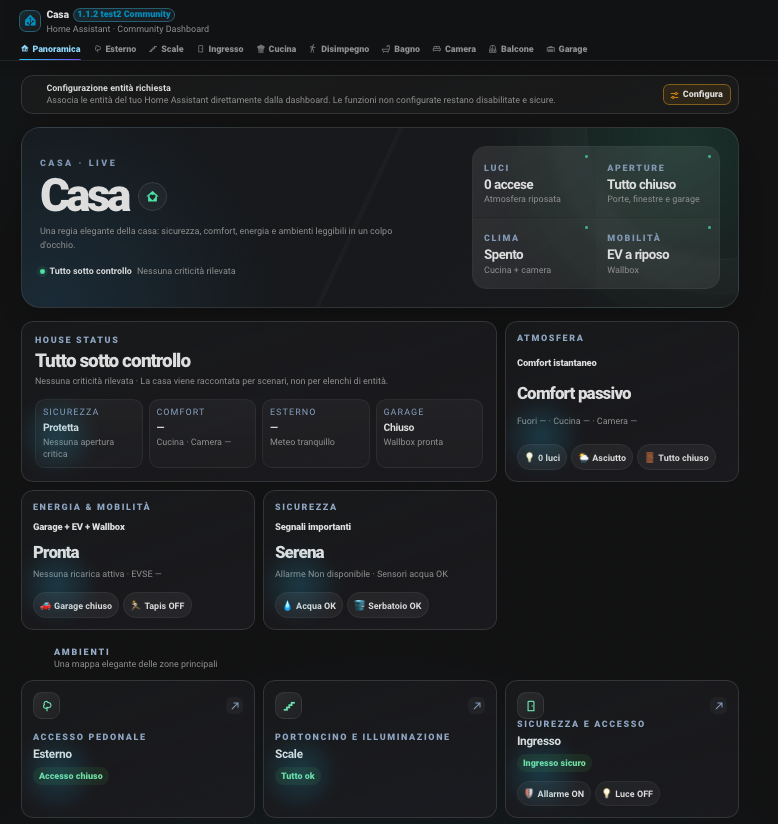
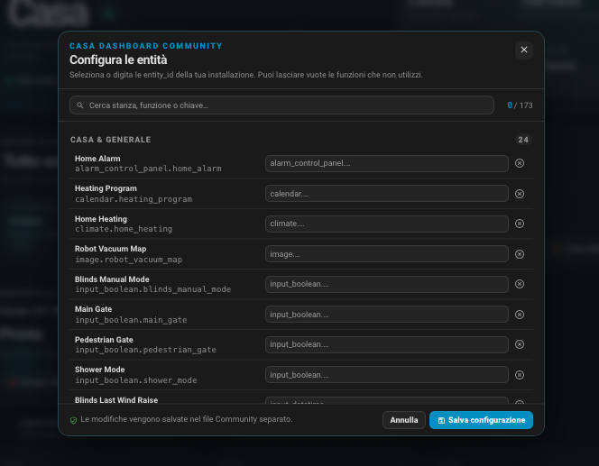

# 🏠 Casa Dashboard Community

[](https://github.com/fabiovit/casa-dashboard/releases)
[](https://hacs.xyz/)
[](https://github.com/fabiovit/casa-dashboard/actions/workflows/hacs.yml)
[](https://github.com/fabiovit/casa-dashboard/actions/workflows/hassfest.yml)
[](LICENSE)

[](https://my.home-assistant.io/redirect/hacs_repository/?owner=fabiovit&repository=casa-dashboard&category=integration)

**Installazione rapida:** clicca **Add to HACS** qui sopra per aprire direttamente Home Assistant e aggiungere questo repository a HACS come integrazione personalizzata.

Una dashboard app-like per **Home Assistant**, pensata per offrire una vista unica della casa senza dipendere dalle classiche card Lovelace.

La Community Edition nasce dalla dashboard personale di Fabio Vittori, ma mantiene **versioning, configurazione ed entity_id completamente separati** per poter essere adattata ad altre installazioni Home Assistant.

Inoltre usa il domain tecnico `casa_dashboard_community`, il pannello `casa-dashboard-community` e risorse frontend dedicate: può quindi convivere nella stessa installazione con una dashboard personale che usa `casa_dashboard`, senza sovrascriverla.

**Realizzato da Fabio Vittori** · [☕ Offrimi un caffè](https://ko-fi.com/fabvittori)

## Versione 1.1.4 Community

La **v1.1.4** consolida la configurazione guidata direttamente dalla dashboard e introduce gli ultimi affinamenti verificati in Home Assistant: ricerca delle entità anche per nome assegnato (`friendly_name`), rendering più stabile senza sfarfallii e visibilità realmente adattiva. Le funzioni non configurate non generano più stati di fallback: card, metriche, automazioni e sezioni vuote restano nascoste.

Le entità non configurate vengono inoltre **nascoste automaticamente** dall'interfaccia: controlli, metriche, ambienti e voci di navigazione compaiono solo quando hanno almeno una configurazione utile. La dashboard resta quindi pulita e si adatta all'impianto reale dell'utente.

Mantiene la separazione tecnica `casa_dashboard_community`, l'installazione HACS corretta e tutte le **173 chiavi logiche configurabili**.

### Novità principali

- configurazione guidata delle **173 entità** direttamente da popup nella dashboard;
- ricerca e suggerimenti delle entity_id disponibili in Home Assistant;
- entità e funzioni non configurate nascoste automaticamente;
- menu e ambienti mostrati solo quando contengono almeno una funzione configurata;
- redesign più profondo, premium e app-like;
- nuova Panoramica con hero/scena di casa e informazioni prioritarie;
- card e controlli ridisegnati con migliore gerarchia visiva;
- avvisi più evidenti per la porta d'ingresso;
- confronto comfort in Cucina più leggibile;
- ordine e composizione della sezione Camera aggiornati;
- luminosità espressa con etichette umane e formato compatto `klx`;
- radiazione solare con descrizione immediata dell'intensità;
- meteo Balcone completamente riorganizzato in blocchi tematici;
- nuova sezione opzionale **Energia solare** con FV, due falde/canali, casa, rete e batteria;
- SOC batteria sempre visibile e flussi carica/scarica più chiari;
- Garage/Wallbox aggiornato: potenza e limite ricarica in **kW**, A/V come dettaglio, carico contatore e sessione;
- supporto automatico a sensori di potenza esposti sia in W sia in kW;
- mappa esterna passata da **157 a 173 chiavi logiche**;
- aggiornamento non distruttivo del file entità: le nuove chiavi vengono aggiunte senza sovrascrivere quelle già configurate.

## Preview

### Panoramica



### Configurazione guidata delle entità



La configurazione può essere aperta direttamente dalla dashboard tramite **Configura**. Le funzioni lasciate vuote non vengono mostrate nell'interfaccia.

## Installazione manuale

1. Copia `custom_components/casa_dashboard_community` in `/config/custom_components/`.
2. Riavvia Home Assistant.
3. Vai in **Impostazioni → Dispositivi e servizi → Aggiungi integrazione**.
4. Cerca **Casa Dashboard Community** e aggiungila.
5. Apri **Casa Dashboard Community** e premi **Configura**.
6. Associa le funzioni che vuoi utilizzare alle tue entity_id reali.
7. Premi **Salva configurazione**.

Il file `/config/www/casa-dashboard-community-entities.json` viene gestito automaticamente dall'integrazione e resta disponibile come fallback/import-export. Le funzioni lasciate vuote non vengono mostrate nella dashboard.

Consulta `examples/ENTITY_MAP.md` per la mappa completa delle **173 associazioni**.

## Aggiornamento da una build Community precedente

Questa build separa definitivamente la Community Edition dal domain `casa_dashboard` usato dalla dashboard personale. Dopo l'aggiornamento, rimuovi l'eventuale vecchia voce **Casa Dashboard Community** basata sul domain precedente e aggiungi nuovamente **Casa Dashboard Community** da **Impostazioni → Dispositivi e servizi**.

Il nuovo file dedicato è `/config/www/casa-dashboard-community-entities.json`. Se avevi già configurato una vecchia Community Edition, puoi riportare manualmente le tue associazioni nel nuovo file. Non viene effettuata una copia automatica dal vecchio `casa-dashboard-entities.json`, proprio per evitare di importare per errore la configurazione della dashboard personale.

Le 16 chiavi `sensor.solar_*` sono opzionali: se non hai un impianto fotovoltaico puoi lasciarle vuote. L'intera sezione Energia solare resterà nascosta.

## HACS

### Installazione con un click

[](https://my.home-assistant.io/redirect/hacs_repository/?owner=fabiovit&repository=casa-dashboard&category=integration)

Clicca il pulsante **Add to HACS** per aprire Home Assistant e aggiungere automaticamente `fabiovit/casa-dashboard` come repository HACS personalizzato di tipo **Integrazione**.

### Installazione HACS manuale

1. Apri **HACS**.
2. Premi **⋮ → Repository personalizzati**.
3. Inserisci `https://github.com/fabiovit/casa-dashboard`.
4. Seleziona **Integrazione**.
5. Premi **Aggiungi**, quindi installa **Casa Dashboard Community**.
6. Riavvia Home Assistant e aggiungi l'integrazione da **Impostazioni → Dispositivi e servizi**.

Download e release sono disponibili anche dalla pagina **Releases** del repository GitHub.

## Configurazione entità

Esempio:

```json
{
  "entities": {
    "light.kitchen_main": "light.luce_cucina",
    "sensor.kitchen_temperature": "sensor.temperatura_cucina",
    "binary_sensor.entry_door": "binary_sensor.porta_ingresso",
    "sensor.solar_pv_power": "sensor.tuo_fotovoltaico_potenza"
  }
}
```

Il file personale resta in `/config/www/` e non viene sovrascritto dagli aggiornamenti HACS.

### Fotovoltaico

Per il nuovo blocco Energia solare sono disponibili 16 chiavi generiche `sensor.solar_*`. Le potenze possono essere in **W o kW**. Per la convenzione dei segni di rete e batteria consulta `examples/ENTITY_MAP.md`.

## Nota importante

Casa Dashboard Community è un **template avanzato**: stanze, dispositivi, automazioni e sensori cambiano da impianto a impianto. Le funzioni non utilizzate possono restare non configurate.

Le logiche visuali dedicate a clima, tende, meteo ed energia sono esempi generici e devono essere adattate alla logica reale del proprio impianto prima di essere considerate una rappresentazione affidabile delle automazioni.

## Supporto

Se il progetto ti piace e vuoi sostenerne lo sviluppo: **[☕ Offrimi un caffè su Ko-fi](https://ko-fi.com/fabvittori)**.

---

# English

**Casa Dashboard Community** is an app-like Home Assistant dashboard built as a complete custom panel rather than a collection of standard Lovelace cards.

Version **1.1.4** consolidates the in-dashboard configuration UI with friendly-name entity search, stable rendering without card flicker, and stricter adaptive visibility. Unconfigured functions no longer create fallback states: empty metrics, automation blocks, cards and room sections stay hidden. The dedicated `casa_dashboard_community` domain remains fully separated from personal Casa Dashboard installations.

The Community Edition now uses the dedicated `casa_dashboard_community` domain and `/config/www/casa-dashboard-community-entities.json`, allowing it to coexist with a personal `casa_dashboard` installation without overwriting it.

**Created by Fabio Vittori** · [☕ Buy me a coffee](https://ko-fi.com/fabvittori)
